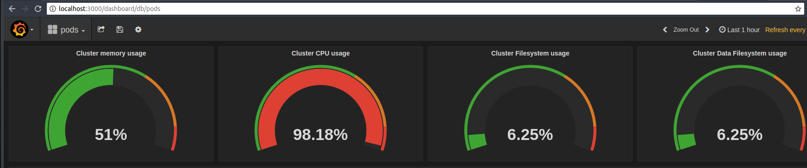

# Prometheus 2.0 \ Grafana 4.6.3 on Kubernetes 1.10.3 with RBAC ON


Helm chart for deploying Prometheus and Grafana with full built in Kubernetes pod and infrastructure dashboard



## Prerequisites

* Kubernetes cluster up and running
* Helm
* Kubectl

## Helm configuration

You will need to install helm and ensure it has sufficient deployment access. See `helm-rbac.yaml`
Please note that this will create a helm service account with admin rights.
You might want to reduce the scope of helm account based on your security requirements.

```
kubectl apply -f helm-rbac.yaml
helm init --service-account helm 
```

Note: for existing helm installs, use `--upgrade` to add new service account

## Installation

Make sure you have kubernetes up and running and a `kubectl` context pointing to your target cluster. <br/>

```
cd helm

kubectl create namespace monitoring

helm install --name kube-prometheus prometheus -f ../values.yaml --namespace monitoring
helm install --name kube-grafana grafana -f ../values.yaml --namespace monitoring

```

## Make sure everything is running

```
kubectl get pods -n monitoring
```

Once everything is running, you can port-forward to check grafana:

```

kubectl port-forward --namespace=monitoring $(kubectl get pods --namespace=monitoring --selector=app=grafana --output=jsonpath='{.items[*].metadata.name}') 3000:3000

```
